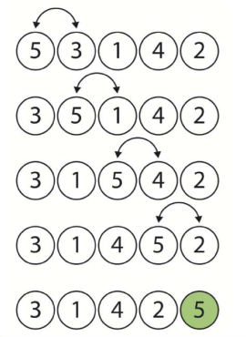
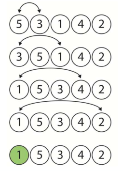
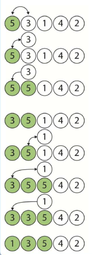

# AlgoritimoOrdenacao-Python

*Note: This ReadMe avaliable in Portuguese and English.*  
*Observação: Esse ReadMe está disponível em português e inglês. *

## English:

##### Sorting in Bubbles:
   - The principle of ordering in bubbles is the exchange of values between consecutive positions, making the highest (or lowest) values "bubble" towards the end of the array.
   - The least efficient of all sorts.

  

##### Ordering in Selection:
   - Selects an item from the arrangement by comparing it with the others, and changing only when it is bigger or smaller.
   - Slightly more efficient than bubble sorting.

  

##### Insertion Ordering:
   - The main feature of this method is that we sort the array with an ordered sub-array located at its beginning, and at each new step, we add one more element to this sub-array, until we reach the last element of the array.
   - Method more efficient than others.

  

__________________________________________________________________________________________________________________________________________________________________

## Portuguese:

##### Ordenação em Bolhas:
  - O princípio do ordenação em bolhas é a troca de valores entre posições consecutivas, fazendo com que os valores mais altos (ou mais baixos) "borbulhem" para o final do arranjo.
  - O menos eficiente de todas as ordenações.

  

##### Ordenação em Seleção:
  - Seleciona um item do arranjo comparando com os demais, e trocando somente quando for maior ou o menor.
  - Um pouco mais eficiente que a ordenação em bolhas.

  

##### Ordenação em Inserção:
  - A principal característica desse método é ordenarmos o arranjo com um sub-arranjo ordenado localizado em seu inicio, e a cada novo passo, acrescentamos a este sub-arranjo mais um elemento, até que atingimos o último elemento do arranjo. 
  - Método mais eficiente que os outros.

  

